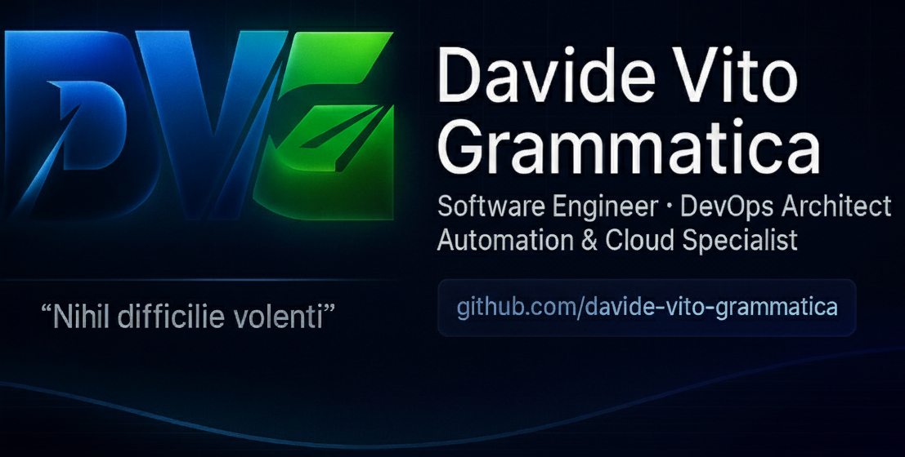

<p align="center">
  
</p>

<!--
  ================================
  SEO METADATA – DAVIDE VITO GRAMMATICA
  ================================
  title: Davide Vito Grammatica | Software Engineer, DevOps Architect, MySQL & PHP Specialist
  description: Official GitHub profile of Davide Vito Grammatica – Italian Software Engineer and DevOps Architect. Expert in PHP, MySQL, Proxmox, Docker, Kubernetes, AI automation, and Home Assistant integrations.
  keywords: Davide Vito Grammatica, GitHub, Software Engineer Italy, DevOps Architect, PHP Developer, MySQL Specialist, Proxmox Expert, Docker Kubernetes Pipelines, Home Assistant Automation, AI Integration, CoGram, The ProXimus, Digital Innovation, Automation Engineer, Cloud Architect, Nihil difficile volenti
  author: Davide Vito Grammatica
  canonical: https://github.com/davide-vito-grammatica/
  robots: index, follow
-->

# 👋 Hi, I’m **Davide Vito Grammatica**
### 💡 *Software Engineer · ICT Architect · Automation & Cloud Specialist*  
#### _"Nihil difficile volenti"_ — *Nothing is difficult for the willing.*


---

## 🧭 About Me
I’m an **Italian Computer Engineer** with a passion for **DevOps, cloud architectures, automation, data engineering and AI**.  
I design and maintain **scalable back-end systems**, orchestrate **CI/CD pipelines**, and integrate **AI-driven and IoT solutions** within complex infrastructures.

My focus lies in **bridging enterprise systems, cloud platforms, and edge devices** — leveraging technologies like **Docker**, **Kubernetes**, **MySQL**, **PHP**, and **Python** to build secure, automated, and data-driven environments.

---

## 🧠 Technical Expertise
- **Languages:** PHP · Python · Node.js · Bash  
- **Databases:** MySQL 8 (query optimization, stored procedures, data analysis)  
- **DevOps & Cloud:** Docker · Kubernetes · LXC · Proxmox · OCI · GitHub Actions · CI/CD pipelines  
- **Automation:** Node-RED · MQTT · Zigbee2MQTT · ESP32 · Frigate AI · Home Assistant  
- **AI & Data:** Machine Learning integration, log correlation, data visualization  
- **OS & Infrastructure:** Linux (Debian / Ubuntu), Nginx, Apache, Git, Network monitoring

---

## 🚀 Currently Working On
- 🧩 **AI-Driven Information Retrieval** – A PHP + MySQL + AI integration model for semantic search across multi-tenant datasets.  
- ⚡ **Smart Energy Automation** – Home Assistant + Node-RED system optimizing solar yield, grid balance, and device orchestration.  
- 📊 **Proxmox LXC Dashboard** – InfluxDB-powered analytics for container performance and uptime tracking.  
- 🔌 **Zigbee Mesh Visualizer** – MQTT-based mapping tool for multi-floor smart home networks.  
- 🌐 **WordPress Multisite Stack** – Dockerized CMS environment with CI/CD and dummy-admin architecture.

---

## 🧩 Tech Focus
`Linux` · `Debian` · `Proxmox` · `Docker` · `Kubernetes` · `GitHub Actions` · `MySQL` · `PHP` · `Node.js` · `Python` · `MQTT` · `Zigbee` · `ESP32` · `Home Assistant` · `OCI` · `CI/CD` · `AI Automation` · `Data Engineering` · `Cloud Infrastructure`

---

## 🧭 Philosophy
> *“Automation isn’t just about efficiency — it’s about clarity, repeatability, and innovation.”*  
> *“Nihil difficile volenti” reminds me that no challenge is too complex when the will to build and learn is stronger than the obstacle.*

---

## 🌍 Let’s Connect
- 🌐 **Website & Blog:** [www.cogram.it](https://www.cogram.it)  
- 💼 **LinkedIn:** [Davide Vito Grammatica](https://www.linkedin.com/in/davidevitogrammatica/)  
- 🧠 **The ProXimus Project:** [www.cogram.it/theproximus](https://www.cogram.it/theproximus)  
- 📬 **Contact:** davidevito.grammatica@ingpec.eu

---

## 📈 GitHub Insights


---

## 🔍 SEO & Indexing Tags
`Davide Vito Grammatica GitHub` · `Software Engineer Italy` · `DevOps Architect` · `PHP Developer` · `MySQL Specialist` · `Proxmox Expert` · `Docker Kubernetes Pipelines` · `Home Assistant Automation` · `AI Integration Developer` · `Cloud Automation Engineer` · `Linux DevOps Italy` · `Smart Home Engineer` · `Data Automation Specialist` · `Nihil difficile volenti`

---

### 🧩 Structured Data for Crawlers (JSON-LD)
```json
{
  "@context": "https://schema.org",
  "@type": "Person",
  "name": "Davide Vito Grammatica",
  "url": "https://github.com/davide-vito-grammatica/",
  "sameAs": [
    "https://www.cogram.it",
    "https://www.linkedin.com/in/davidevitogrammatica/"
  ],
  "jobTitle": "Software Engineer, DevOps Architect",
  "worksFor": {
    "@type": "Organization",
    "name": "CoGram"
  },
  "knowsAbout": ["DevOps", "PHP", "MySQL", "Proxmox", "Docker", "Kubernetes", "Home Assistant", "AI Automation"],
  "nationality": "Italian",
  "motto": "Nihil difficile volenti"
}
